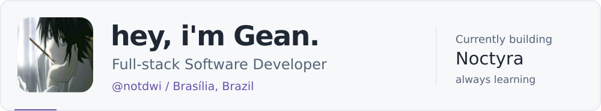
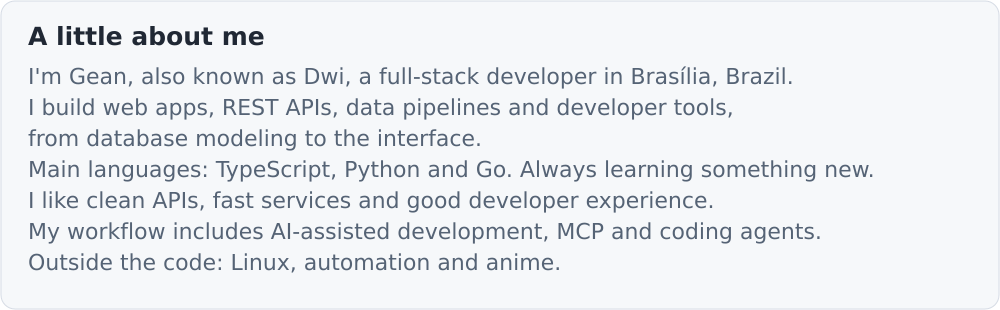
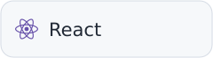
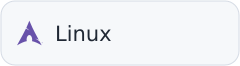
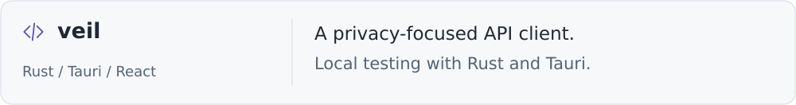
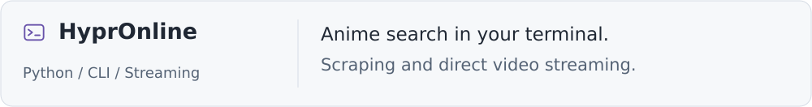
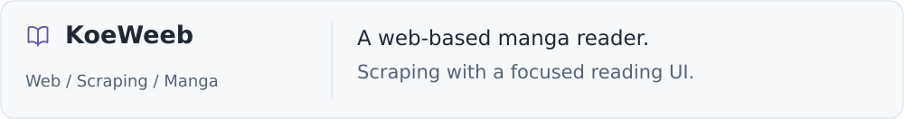
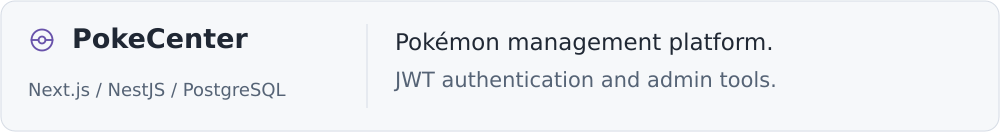

<picture><source media="(prefers-color-scheme: dark)" srcset="assets/profile-v7/hero-integrated-dark.svg"></picture>

<a href="https://dwi.best"><picture><source media="(prefers-color-scheme: dark)" srcset="assets/profile-v7/contact-portfolio-dark.svg"></picture></a>
<a href="mailto:dwi@haunt.gg"><picture><source media="(prefers-color-scheme: dark)" srcset="assets/profile-v7/contact-email-dark.svg"></picture></a>
<a href="https://github.com/notdwi?tab=repositories"><picture><source media="(prefers-color-scheme: dark)" srcset="assets/profile-v7/contact-github-dark.svg"></picture></a>

<picture><source media="(prefers-color-scheme: dark)" srcset="assets/profile-v7/about-dark.svg"></picture>

<picture><source media="(prefers-color-scheme: dark)" srcset="assets/profile-v7/heading-stack-dark.svg"></picture>

<a href="https://www.typescriptlang.org/"><picture><source media="(prefers-color-scheme: dark)" srcset="assets/profile-v7/tech-typescript-dark.svg"></picture></a>
<a href="https://www.python.org/"><picture><source media="(prefers-color-scheme: dark)" srcset="assets/profile-v7/tech-python-dark.svg"></picture></a>
<a href="https://go.dev/"><picture><source media="(prefers-color-scheme: dark)" srcset="assets/profile-v7/tech-go-dark.svg"></picture></a>
<a href="https://www.rust-lang.org/"><picture><source media="(prefers-color-scheme: dark)" srcset="assets/profile-v7/tech-rust-dark.svg"></picture></a>

<a href="https://react.dev/"><picture><source media="(prefers-color-scheme: dark)" srcset="assets/profile-v7/tech-react-dark.svg"></picture></a>
<a href="https://nextjs.org/"><picture><source media="(prefers-color-scheme: dark)" srcset="assets/profile-v7/tech-nextjs-dark.svg"></picture></a>
<a href="https://vuejs.org/"><picture><source media="(prefers-color-scheme: dark)" srcset="assets/profile-v7/tech-vuedotjs-dark.svg"></picture></a>
<a href="https://nestjs.com/"><picture><source media="(prefers-color-scheme: dark)" srcset="assets/profile-v7/tech-nestjs-dark.svg"></picture></a>

<a href="https://flask.palletsprojects.com/"><picture><source media="(prefers-color-scheme: dark)" srcset="assets/profile-v7/tech-flask-dark.svg"></picture></a>
<a href="https://tauri.app/"><picture><source media="(prefers-color-scheme: dark)" srcset="assets/profile-v7/tech-tauri-dark.svg"></picture></a>
<a href="https://www.postgresql.org/"><picture><source media="(prefers-color-scheme: dark)" srcset="assets/profile-v7/tech-database-dark.svg"></picture></a>
<a href="https://www.mysql.com/"><picture><source media="(prefers-color-scheme: dark)" srcset="assets/profile-v7/tech-mysql-dark.svg"></picture></a>

<a href="https://archlinux.org/"><picture><source media="(prefers-color-scheme: dark)" srcset="assets/profile-v7/tech-archlinux-dark.svg"></picture></a>
<a href="https://git-scm.com/"><picture><source media="(prefers-color-scheme: dark)" srcset="assets/profile-v7/tech-git-dark.svg"></picture></a>
<a href="https://github.com/features/actions"><picture><source media="(prefers-color-scheme: dark)" srcset="assets/profile-v7/tech-githubactions-dark.svg"></picture></a>
<a href="https://developer.mozilla.org/en-US/docs/Glossary/REST"><picture><source media="(prefers-color-scheme: dark)" srcset="assets/profile-v7/tech-api-dark.svg"></picture></a>

<picture><source media="(prefers-color-scheme: dark)" srcset="assets/profile-v7/heading-projects-dark.svg"></picture>

<a href="https://github.com/notdwi/veil"><picture><source media="(prefers-color-scheme: dark)" srcset="assets/profile-v7/project-veil-dark.svg"></picture></a>

<a href="https://github.com/notdwi/HyprOnline"><picture><source media="(prefers-color-scheme: dark)" srcset="assets/profile-v7/project-hypronline-dark.svg"></picture></a>

<a href="https://github.com/notdwi/KoeWeeb"><picture><source media="(prefers-color-scheme: dark)" srcset="assets/profile-v7/project-koeweeb-dark.svg"></picture></a>

<a href="https://github.com/notdwi/PokeCenter"><picture><source media="(prefers-color-scheme: dark)" srcset="assets/profile-v7/project-pokecenter-dark.svg"></picture></a>

