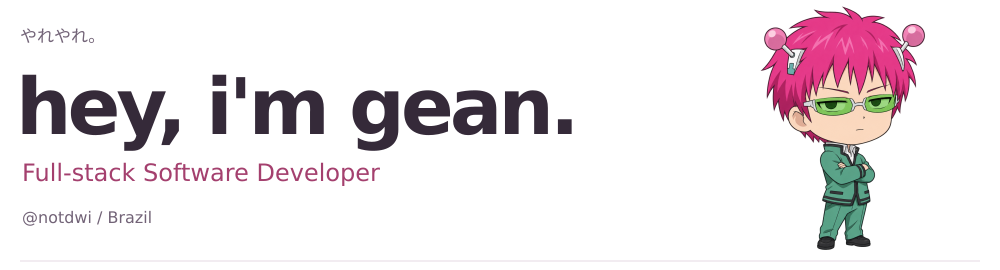

<picture><source media="(prefers-color-scheme: dark)" srcset="assets/profile-v5/header-saiki-chibi-static-dark.svg"></picture>

<a href="https://dwi.best"><picture><source media="(prefers-color-scheme: dark)" srcset="assets/profile-v5/contact-portfolio-dark.svg"></picture></a>
  <a href="mailto:dwi@haunt.gg"><picture><source media="(prefers-color-scheme: dark)" srcset="assets/profile-v5/contact-email-dark.svg"></picture></a>
  <a href="https://github.com/notdwi?tab=repositories"><picture><source media="(prefers-color-scheme: dark)" srcset="assets/profile-v5/contact-github-dark.svg"></picture></a>

<picture><source media="(prefers-color-scheme: dark)" srcset="assets/profile-v5/profile-summary-dark.svg"></picture>

<picture><source media="(prefers-color-scheme: dark)" srcset="assets/profile-v5/heading-stack-dark.svg"></picture>

<a href="https://www.typescriptlang.org/"><picture><source media="(prefers-color-scheme: dark)" srcset="assets/profile-v5/compact-tech-typescript-dark.svg"></picture></a>
  <a href="https://www.python.org/"><picture><source media="(prefers-color-scheme: dark)" srcset="assets/profile-v5/compact-tech-python-dark.svg"></picture></a>
  <a href="https://go.dev/"><picture><source media="(prefers-color-scheme: dark)" srcset="assets/profile-v5/compact-tech-go-dark.svg"></picture></a>
  <a href="https://react.dev/"><picture><source media="(prefers-color-scheme: dark)" srcset="assets/profile-v5/compact-tech-react-dark.svg"></picture></a>

<a href="https://nextjs.org/"><picture><source media="(prefers-color-scheme: dark)" srcset="assets/profile-v5/compact-tech-nextjs-dark.svg"></picture></a>
  <a href="https://vuejs.org/"><picture><source media="(prefers-color-scheme: dark)" srcset="assets/profile-v5/compact-tech-vuedotjs-dark.svg"></picture></a>
  <a href="https://www.postgresql.org/"><picture><source media="(prefers-color-scheme: dark)" srcset="assets/profile-v5/compact-tech-database-dark.svg"></picture></a>
  <a href="https://archlinux.org/"><picture><source media="(prefers-color-scheme: dark)" srcset="assets/profile-v5/compact-tech-archlinux-dark.svg"></picture></a>

<picture><source media="(prefers-color-scheme: dark)" srcset="assets/profile-v5/heading-projects-dark.svg"></picture>

<a href="https://github.com/notdwi/veil"><picture><source media="(prefers-color-scheme: dark)" srcset="assets/profile-v5/compact-card-veil-dark.svg"></picture></a>
  <a href="https://github.com/notdwi/HyprOnline"><picture><source media="(prefers-color-scheme: dark)" srcset="assets/profile-v5/compact-card-hypronline-dark.svg"></picture></a>

<a href="https://github.com/notdwi/KoeWeeb"><picture><source media="(prefers-color-scheme: dark)" srcset="assets/profile-v5/compact-card-koeweeb-dark.svg"></picture></a>
  <a href="https://github.com/notdwi/PokeCenter"><picture><source media="(prefers-color-scheme: dark)" srcset="assets/profile-v5/compact-card-pokecenter-dark.svg"></picture></a>

<picture><source media="(prefers-color-scheme: dark)" srcset="assets/profile-v5/wave-dark.svg"></picture>
<picture><source media="(prefers-color-scheme: dark)" srcset="assets/profile-v5/saiki-note-dark.svg"></picture>
